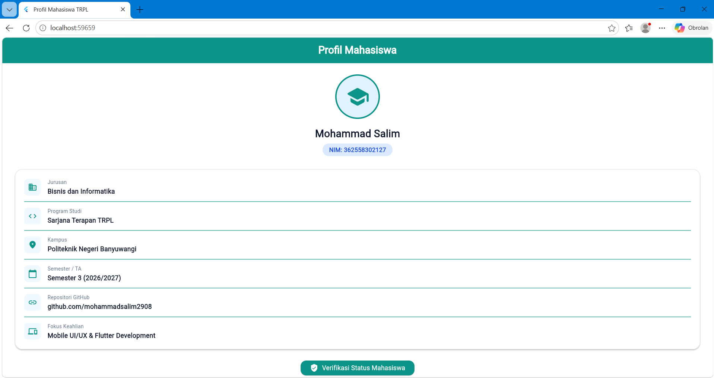

# Modul 01: Praktikum Flutter & Ecosystem Refresh

Aplikasi profil mahasiswa sederhana yang dibangun menggunakan Flutter sebagai bagian dari praktikum modul 1.

## Deskripsi Aplikasi
Aplikasi ini menampilkan kartu profil mahasiswa interaktif yang berisi informasi akademik, link repositori GitHub, serta fokus keahlian. Dilengkapi juga dengan tombol verifikasi status yang menampilkan SnackBar.

## Screenshot Aplikasi

## Kendala Setup dan Solusi
- **Kendala:** Terjadi error `CrossAlignment isn't defined` saat melakukan Hot Reload dan tampilan tidak kunjung berubah di browser.
- **Solusi:** Memperbaiki penulisan nama properti yang benar yaitu `CrossAxisAlignment.start` pada widget `_InfoRow` dan melakukan restart kompilasi.