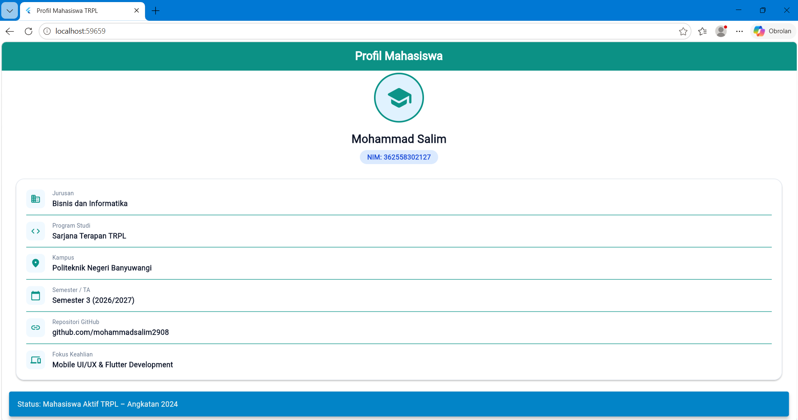

# Laporan Praktikum Modul 01: Mobile Ecosystem, Flutter Setup & Profile App

- **Nama**: Mohammad Salim
- **NIM**: 362558302127
- **Kelas / Prodi**: 2C / Sarjana Terapan TRPL
- **Mata Kuliah**: Pemrograman Perangkat Bergerak (Semester 3)

---

## 1. Ringkasan Aktivitas
- melakukan setup lingkungan kerja Flutter dan Dart SDK.
- belajar menguji kesiapan sistem menggunakan flutter doctor.
- mengonfigurasi perangkat pengetesan dengan emulator maupun peramban web (Chrome),
- membangun aplikasi kartu profil mahasiswa interaktif menggunakan berbagai widget 
  Flutter seperti Card, Column, Row, dan ElevatedButton.
- memahami mekanisme Hot Reload dan Hot Restart.

## 2. Bukti Tangkapan Layar (Running App)
[Sertakan minimal 2 screenshot bukti aplikasi profil berjalan di emulator atau HP fisik Anda]

## 3. Kendala yang Dihadapi & Solusinya
- **Kendala**: 
    Perubahan data baru tidak kunjung dirender di layar browser walau sudah dilakukan Hot Reload, serta muncul Error: 
    The getter 'CrossAlignment' isn't defined for the type '_InfoRow'
- **Solusi**: 
    Memperbaiki kekeliruan penulisan (typo) properti dari CrossAlignment.start menjadi CrossAxisAlignment.start

## 4. Jawaban Pertanyaan Refleksi
1. **Pilihan Native vs Flutter**: 
    Penggunaan native (Kotlin/Swift) menjadi pilihan utama ketika aplikasi membutuhkan akses hardware yang sangat mendalam atau API spesifik OS seperti fitur sensor AR, komunikasi Bluetooth tingkat lanjut, maupun rendering grafis 3D performa tinggi. Faktor penentu utamanya terletak pada kompleksitas integrasi platform dan efisiensi sumber daya development. Jika proyek membutuhkan rilis cepat di platform Android dan iOS secara bersamaan dengan efisiensi biaya serta basis kode tunggal, Flutter adalah solusi ideal. Namun, jika ketergantungan pada fitur native sangat dominan, pendekatan native tetap tidak tergantikan.
2. **Prinsip UI = f(state)**:
    Prinsip $UI = f(state)$ mengubah pola pikir pengembangan tampilan dari pendekatan imperatif menjadi deklaratif. Pada pendekatan Android XML tradisional, perubahan tampilan dilakukan secara manual dengan mencari elemen UI dan mengubah propertinya satu per satu saat ada kejadian. Sebaliknya, dalam Flutter deklaratif, pengembang hanya perlu mendefinisikan bentuk UI berdasarkan kondisi data (state) saat itu. Ketika state berubah, Flutter secara otomatis akan memperbarui komponen UI yang relevan, sehingga menghilangkan kebutuhan manipulasi manual dan meminimalkan bug inkonsistensi tampilan.
3. **Pentingnya Conventional Commits**: 
    Penerapan Conventional Commits seperti penulisan prefiks feat:, fix:, atau docs: menciptakan riwayat perubahan kode yang terstruktur dan mudah dipahami oleh seluruh anggota tim tanpa harus memeriksa baris kode satu per satu. Selain memudahkan kolaborasi dan memungkinkan pembuatan catatan rilis (changelog) secara otomatis, kebiasaan ini juga mencerminkan profesionalisme dalam pengelolaan versi kode (version control), yang menjadi nilai tambah berharga pada portofolio karier software engineer.